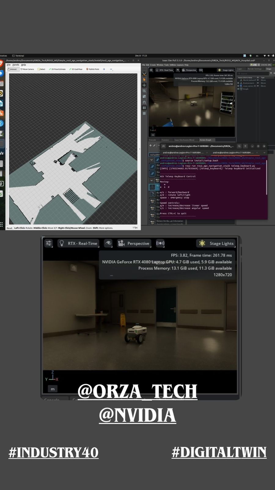

# ROS2 AGV Navigation Stack with RTAB-Map 3D SLAM

[](https://docs.ros.org/en/humble/)
[](LICENSE)
[](https://developer.nvidia.com/isaac-sim)
[](http://introlab.github.io/rtabmap/)

Production-ready navigation stack for AGV/AMR platforms featuring **RTAB-Map 3D SLAM** with multi-sensor fusion (3D LiDAR + Stereo Camera + IMU), **Spatio-Temporal Voxel Layer** for true 3D obstacle detection, and full Nav2 integration. Configured for the **Nova Carter** robot in **NVIDIA Isaac Sim**.




## Features

- **RTAB-Map 3D SLAM**: Full 3D mapping with loop closure using ICP odometry
- **Multi-Sensor Fusion**: 3D LiDAR, Stereo cameras, IMU, and wheel odometry
- **Robot Localization EKF**: Fuses wheel odometry + IMU for robust odometry
- **Spatio-Temporal Voxel Layer**: True 3D obstacle detection without 2D conversion
- **Nav2 Navigation**: Full navigation stack with DWB controller and recovery behaviors
- **Temporal Voxel Decay**: Dynamic obstacle handling with configurable decay
- **Isaac Sim Ready**: Pre-configured for Nova Carter with proper timestamp handling

## Architecture

```
┌─────────────────────────────────────────────────────────────────────────┐
│                           Isaac Sim                                      │
│  ┌──────────┐  ┌──────────┐  ┌──────────┐  ┌──────────┐  ┌──────────┐  │
│  │ 3D LiDAR │  │  Stereo  │  │   IMU    │  │  Wheel   │  │  Clock   │  │
│  │PointCloud│  │ Cameras  │  │          │  │  Odom    │  │          │  │
│  └────┬─────┘  └────┬─────┘  └────┬─────┘  └────┬─────┘  └────┬─────┘  │
└───────┼─────────────┼─────────────┼─────────────┼─────────────┼────────┘
        │             │             │             │             │
        ▼             ▼             ▼             ▼             ▼
┌───────────────────────────────────────────────────────────────────────┐
│                    Sensor Fusion Layer                                 │
│                                                                        │
│   ┌─────────────────────────────────────────────────────────────┐     │
│   │              robot_localization (EKF)                        │     │
│   │         Wheel Odometry + IMU → /odometry/filtered            │     │
│   └─────────────────────────────────────────────────────────────┘     │
└───────────────────────────────────────────────────────────────────────┘
        │
        ▼
┌───────────────────────────────────────────────────────────────────────┐
│                        RTAB-Map SLAM                                   │
│                                                                        │
│   ┌─────────────┐    ┌─────────────┐    ┌─────────────┐              │
│   │ ICP Odometry│    │  Graph SLAM │    │ Loop Closure│              │
│   │ (3D LiDAR)  │───▶│  (g2o/GTSAM)│◀───│  Detection  │              │
│   └─────────────┘    └──────┬──────┘    └─────────────┘              │
│                             │                                         │
│                             ▼                                         │
│                      ┌──────────────┐                                 │
│                      │   /map       │                                 │
│                      │   /tf        │                                 │
│                      └──────────────┘                                 │
└───────────────────────────────────────────────────────────────────────┘
        │
        ▼
┌───────────────────────────────────────────────────────────────────────┐
│                     Nav2 Navigation Stack                              │
│                                                                        │
│   ┌─────────────────────────────────────────────────────────────┐     │
│   │         Spatio-Temporal Voxel Layer (STVL)                   │     │
│   │    3D PointCloud → 3D Voxel Grid → 2D Costmap Projection     │     │
│   │              (No pointcloud_to_laserscan!)                    │     │
│   └─────────────────────────────────────────────────────────────┘     │
│                             │                                         │
│            ┌────────────────┼────────────────┐                        │
│            ▼                ▼                ▼                        │
│   ┌─────────────┐  ┌─────────────┐  ┌─────────────┐                  │
│   │   NavFn     │  │    DWB      │  │  Recovery   │                  │
│   │  Planner    │  │ Controller  │  │  Behaviors  │                  │
│   └─────────────┘  └──────┬──────┘  └─────────────┘                  │
│                           │                                           │
│                           ▼                                           │
│                    ┌──────────────┐                                   │
│                    │   /cmd_vel   │──────▶ Robot                      │
│                    └──────────────┘                                   │
└───────────────────────────────────────────────────────────────────────┘
```

## Prerequisites

### Install Dependencies

```bash
# RTAB-Map
sudo apt install ros-humble-rtabmap-ros

# Robot Localization
sudo apt install ros-humble-robot-localization

# Nav2 Navigation
sudo apt install ros-humble-navigation2 ros-humble-nav2-bringup

# Spatio-Temporal Voxel Layer
sudo apt install ros-humble-spatio-temporal-voxel-layer

# Stereo Processing
sudo apt install ros-humble-stereo-image-proc ros-humble-depth-image-proc

# Visualization
sudo apt install ros-humble-rviz2
```

## Installation

```bash
# Create workspace
mkdir -p ~/agv_ws/src
cd ~/agv_ws/src

# Clone repository
git clone https://github.com/AndresIslas99/ros2-agv-navigation-stack.git

# Install dependencies
cd ~/agv_ws
rosdep install --from-paths src --ignore-src -r -y

# Build
colcon build --symlink-install
source install/setup.bash
```

## Quick Start

### 1. Launch Isaac Sim with Nova Carter

Open Isaac Sim, load Nova Carter in your environment, and ensure ROS2 bridge is enabled with clock publishing.

Verify topics:
```bash
ros2 topic list
# Should see:
# /clock
# /front_3d_lidar/lidar_points
# /front_stereo_camera/left/image_raw
# /front_stereo_camera/right/image_raw
# /chassis/odom
# /chassis/imu
# /cmd_vel
```

### 2. Start SLAM Mapping

```bash
# Terminal 1: Launch RTAB-Map SLAM + Nav2
ros2 launch ros2_agv_navigation_stack bringup.launch.py slam:=true

# Terminal 2: Teleop for manual mapping
ros2 run ros2_agv_navigation_stack teleop_keyboard.py
```

Drive the robot to build the map. RTAB-Map will handle loop closure automatically.

### 3. Save the Map

The RTAB-Map database is automatically saved to `~/rtabmap.db`. To export as 2D grid:

```bash
ros2 run ros2_agv_navigation_stack save_map.py --map-name my_warehouse
```

### 4. Autonomous Navigation

Once you have a map, navigate using RViz's "2D Goal Pose" tool:

```bash
ros2 launch ros2_agv_navigation_stack bringup.launch.py \
    slam:=false \
    localization:=true \
    database_path:=~/rtabmap.db
```

## Launch Files

| Launch File | Description |
|-------------|-------------|
| `bringup.launch.py` | Full stack: RTAB-Map + EKF + Nav2 |
| `slam_mapping.launch.py` | SLAM only for mapping |

### Launch Arguments

```bash
ros2 launch ros2_agv_navigation_stack bringup.launch.py --show-args
```

| Argument | Default | Description |
|----------|---------|-------------|
| `use_sim_time` | `true` | Use simulation clock |
| `slam` | `true` | Enable SLAM mode |
| `localization` | `false` | Enable localization in existing map |
| `database_path` | `~/rtabmap.db` | RTAB-Map database path |
| `use_rviz` | `true` | Launch RViz |

## Configuration

### RTAB-Map Parameters (`config/rtabmap_params.yaml`)

Key parameters for 3D SLAM:

```yaml
# 3D LiDAR input
subscribe_scan_cloud: true
Icp/Strategy: 1              # Point-to-Plane ICP
Icp/VoxelSize: 0.05          # 5cm voxel downsampling

# Stereo camera input
subscribe_stereo: true

# Loop closure
RGBD/ProximityBySpace: true
Optimizer/Strategy: 2        # GTSAM optimizer
```

### Spatio-Temporal Voxel Layer (`config/nav2_params.yaml`)

True 3D obstacle detection:

```yaml
stvl_layer:
  plugin: "spatio_temporal_voxel_layer/SpatioTemporalVoxelLayer"
  voxel_decay: 15.0           # Seconds before voxels clear
  voxel_size: 0.05            # 5cm resolution
  min_obstacle_height: 0.1    # Ignore ground
  max_obstacle_height: 2.0    # Max obstacle height
  model_type: 1               # 3D LiDAR mode
```

### Robot Localization EKF (`config/ekf_params.yaml`)

Sensor fusion configuration:

```yaml
# Wheel odometry
odom0: /chassis/odom
odom0_config: [true, true, false, ...]   # x, y, vx, vy, vyaw

# IMU
imu0: /chassis/imu
imu0_config: [false, false, false, ...]  # roll, pitch, yaw, angular vel, accel
```

## Sensor Topics

### Input Topics

| Topic | Type | Source |
|-------|------|--------|
| `/front_3d_lidar/lidar_points` | `PointCloud2` | 3D LiDAR |
| `/front_stereo_camera/left/image_raw` | `Image` | Left camera |
| `/front_stereo_camera/right/image_raw` | `Image` | Right camera |
| `/chassis/odom` | `Odometry` | Wheel encoders |
| `/chassis/imu` | `Imu` | Chassis IMU |
| `/clock` | `Clock` | Simulation time |

### Output Topics

| Topic | Type | Description |
|-------|------|-------------|
| `/map` | `OccupancyGrid` | 2D occupancy grid |
| `/rtabmap/cloud_map` | `PointCloud2` | 3D point cloud map |
| `/odometry/filtered` | `Odometry` | EKF-fused odometry |
| `/cmd_vel` | `Twist` | Velocity commands |
| `/plan` | `Path` | Global navigation path |

## Troubleshooting

### RTAB-Map not receiving data
```bash
# Check sensor topics
ros2 topic hz /front_3d_lidar/lidar_points
ros2 topic hz /front_stereo_camera/left/image_raw

# Verify timestamp synchronization
ros2 topic echo /clock
```

### Poor mapping quality
- Increase `Icp/Iterations` for more accurate registration
- Reduce `Icp/VoxelSize` for finer detail (more CPU)
- Ensure good lighting for stereo cameras
- Move slowly during mapping

### Navigation failures
- Check costmap visualization in RViz
- Verify STVL is receiving point clouds
- Reduce `voxel_decay` if obstacles persist too long
- Increase `inflation_radius` for safer paths

## Performance Tuning

| Parameter | Effect | Trade-off |
|-----------|--------|-----------|
| `Icp/VoxelSize` | Map resolution | Lower = better quality, more CPU |
| `voxel_decay` | Dynamic obstacles | Lower = faster clearing, may miss |
| `update_frequency` | Costmap refresh | Higher = more responsive, more CPU |
| `Rtabmap/DetectionRate` | SLAM rate | Higher = more CPU |

## License

MIT License - see [LICENSE](LICENSE)

## Author

**Andrés Islas Bravo**  
Robotics & Autonomous Systems Engineer  
[LinkedIn](https://linkedin.com/in/andres-islas-bravo) | [GitHub](https://github.com/AndresIslas99)

## Acknowledgments

- [RTAB-Map](http://introlab.github.io/rtabmap/) - Mathieu Labbé
- [Nav2](https://navigation.ros.org/) - Steve Macenski
- [Spatio-Temporal Voxel Layer](https://github.com/SteveMacenski/spatio_temporal_voxel_layer) - Steve Macenski
- [NVIDIA Isaac Sim](https://developer.nvidia.com/isaac-sim)
